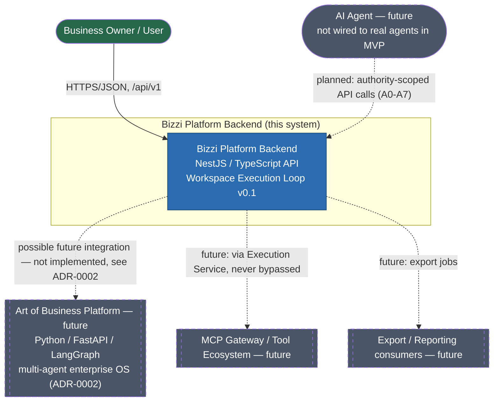

# C1 — System Context

Scope: Bizzi Platform Backend (MVP). See `docs/c4/README.md` for the
solid = in-scope / dashed = future convention, and ADR-0002 for why the
platform-wide "Art of Business" system is drawn as external/future.

## Actors

- **Business Owner / User** — the only actor with real authorization in the
  MVP (ADR-0006, owner-only). Uses the API directly over HTTPS/JSON.
- **AI Agent (future)** — the enterprise spec (`04_AGENT_LIBRARY`,
  `01_GOVERNANCE/AUTHORITY_MATRIX.md`) defines 84 agents with authority
  levels A0–A7. None are wired to this backend in the MVP; this is Phase 3,
  WP-19 (Agent module), and is explicitly flagged as governance-sensitive in
  `docs/planning/WORK_PACKAGES.md`.

## External systems (all future)

- **Art of Business Platform** — the platform-wide Python/FastAPI/LangGraph
  multi-agent OS described in `10_IMPLEMENTATION/TARGET_TECH_STACK.md`. Per
  ADR-0002, this backend is scoped independently; any integration is a
  future decision requiring its own ADR.
- **MCP Gateway / Tool Ecosystem** — governed external-tool access
  (`09_MCP_INFRASTRUCTURE`). Per `12_APPLICATION_SERVICES/APPLICATION_SERVICE_ARCHITECTURE.md`,
  application-level services must never call MCP directly — only through an
  Execution Service. Not built in the MVP.
- **Export / Reporting consumers** — anything consuming exported data;
  `ExportFileStorage` is only a skeleton interface in the MVP (WP-14).
