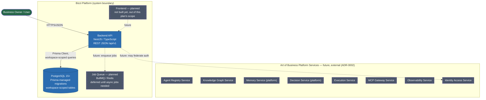

# C2 — Container Diagram

Scope: containers inside and immediately around the Bizzi Platform Backend
system boundary. Solid = MVP (Phase 0/1). Dashed = planned (Phase 2+ or
external, per ADR-0002).

## Containers in MVP scope

| Container | Technology | Responsibility |
|---|---|---|
| Backend API | NestJS / TypeScript | All MVP modules (Workspace, Authorization, Validation, Audit, Event, Task, Decision, Memory, Dashboard, Health) — see C3 |
| PostgreSQL | PostgreSQL 15+, Prisma | Workspace-scoped relational store; schema changes only via committed Prisma migrations |

## Containers explicitly deferred (named, not built)

| Container | Status | Trigger to build |
|---|---|---|
| Job Queue (BullMQ/Redis) | Deferred | First real need for async/background work — `01_TECH_STACK_DECISION.md` |
| Frontend SPA | Not started | Separate plan, out of this document's scope |
| Identity Access Service (federated) | Dev stub only (WP-04) | Real provider selection (Auth0/Clerk/Supabase) |

## Containers that belong to the platform-wide vision, not this system

The eight "Art of Business Platform Services" boxes (Agent Registry,
Knowledge Graph, Memory, Decision, Execution, MCP Gateway, Observability,
Identity Access — full list and one-liners in
`11_PLATFORM_SERVICES/PLATFORM_SERVICE_ARCHITECTURE.md`) are part of the
platform-wide "Art of Business" architecture, not containers this backend
build produces. They're shown here only to make the system boundary honest
about what's outside it. Per ADR-0002, integrating with them is a future,
separately-ADR'd decision.
