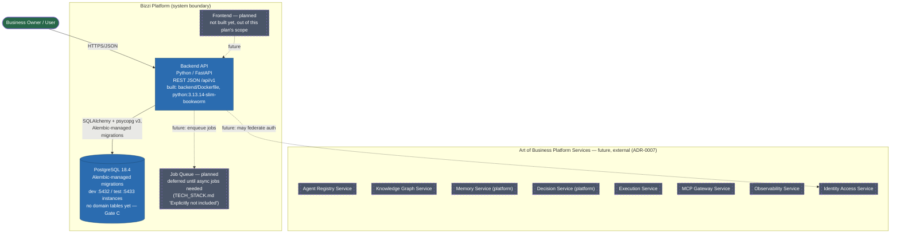

# C2 — Container Diagram

Scope: containers inside and immediately around the Bizzi Platform Backend
system boundary. Solid = built (Gate B, merged to `main`). Dashed = planned
(Gate C+, or external per ADR-0007).

Stack: Python + FastAPI + PostgreSQL, per ADR-0007 (supersedes the original
NestJS/TypeScript/Prisma scope this diagram used to describe — see
`docs/planning/TECH_STACK.md` for exact pinned versions).

## Containers in MVP scope (built, Gate B)

| Container | Technology | Responsibility |
|---|---|---|
| Backend API | Python 3.13.14, FastAPI 0.139.2, Uvicorn | `/health` endpoint only so far; Gate C adds EnterpriseObject/AgentDefinition/Task/Auth/Event/AuditRecord/ContextPackage/RuntimeSession routers — see C3 |
| PostgreSQL | PostgreSQL 18.4-alpine, SQLAlchemy 2.0 + Alembic 1.18 | Workspace-scoped relational store once Gate C lands (ADR-0004); currently holds only Alembic's own `alembic_version` table (baseline migration, no domain tables yet). Schema changes only via committed Alembic migrations. |

## Containers explicitly deferred (named, not built)

| Container | Status | Trigger to build |
|---|---|---|
| Job Queue | Deferred | First real, demonstrated need for async/background work — `docs/planning/TECH_STACK.md` "Explicitly not included" |
| Frontend SPA | Not started | Separate plan, out of this document's scope |
| Identity Access Service (federated) | Not started | Gate C, WP16 "Minimal Identity and Authentication" (`50_IMPLEMENTATION/MVP_WORK_PACKAGE_PLAN.md`) |

## Containers that belong to the platform-wide vision, not this system

The eight "Art of Business Platform Services" boxes (Agent Registry,
Knowledge Graph, Memory, Decision, Execution, MCP Gateway, Observability,
Identity Access — full list and one-liners in
`11_PLATFORM_SERVICES/PLATFORM_SERVICE_ARCHITECTURE.md`) are part of the
platform-wide "Art of Business" architecture, not containers this backend
build produces. They're shown here only to make the system boundary honest
about what's outside it. Per ADR-0007, integrating with them is a future,
separately-ADR'd decision — including how they'd relate to the
provider-neutral agent context model in `PRE-CODING-BRIEF.md` §5.3.
