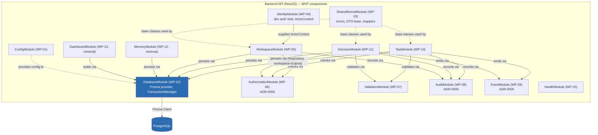

# C3 — Component Diagram (Backend API container)

Scope: components (NestJS modules) inside the Backend API container, MVP
only. Ordering follows `30_BACKEND_IMPLEMENTATION_PLAN/06_MODULE_IMPLEMENTATION_SEQUENCE.md`
and WP IDs in `docs/planning/WORK_PACKAGES.md`.

## Module responsibilities

| Module | Responsibility | Governing ADR/doc |
|---|---|---|
| ConfigModule | Typed, validated env config | `01_TECH_STACK_DECISION.md` |
| DatabaseModule | Prisma client, `TransactionManager` | ADR-0003 |
| SharedKernelModule | Base errors/DTOs/mappers, imports nothing from `modules/` | ADR-0003 |
| IdentityModule | Dev auth stub → `ActorContext` | `01_TECH_STACK_DECISION.md` §Auth |
| WorkspaceModule | `CompanyWorkspace`, `WorkspaceSettings` — root aggregate | ADR-0004 |
| AuthorizationModule | Central `AuthorizationService`, owner-only for MVP | ADR-0006 |
| ValidationModule | Business-rule validation, separate from DTO validation | `07_SERVICE_IMPLEMENTATION_GUIDE.md` |
| AuditModule | `AuditService` — sole path to audit writes | ADR-0005 |
| EventModule | `RuntimeEventService` — post-commit coordination signal | ADR-0005 |
| TaskModule | Task create/complete lifecycle | `02_MVP_VERTICAL_SLICE.md` |
| DecisionModule | Decision create/confirm lifecycle | `02_MVP_VERTICAL_SLICE.md` |
| MemoryModule | `MemoryEntry` create/activate (minimal, no semantic search) | `02_MVP_VERTICAL_SLICE.md` |
| DashboardModule | `DashboardMetric` read (minimal, no custom dashboards) | `02_MVP_VERTICAL_SLICE.md` |
| HealthModule | Liveness/readiness | `11_CI_CD_READINESS_PLAN.md` |

Every arrow in the diagram above is one-directional per ADR-0003
(Controller→Service→Repository). No module in this list imports "up" from a
module that depends on it.
