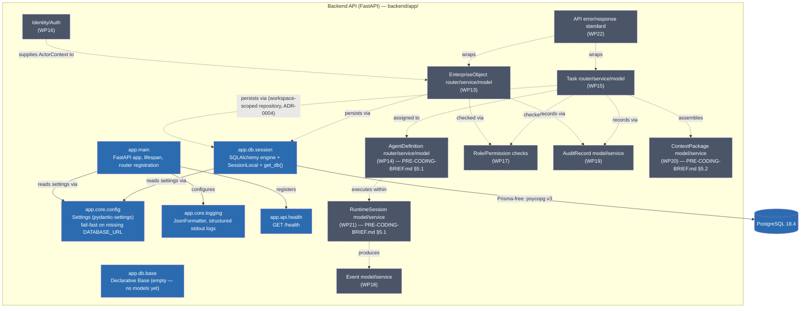

# C3 — Component Diagram (Backend API container)

Scope: components inside the Backend API container. Solid = built (Gate B,
`backend/app/`, merged to `main`). Dashed = planned (Gate C,
`50_IMPLEMENTATION/MVP_WORK_PACKAGE_PLAN.md` WP13–WP22).

This is a from-scratch rewrite for the actual Python/FastAPI package
structure — the previous version of this diagram was NestJS-module-based
(`ConfigModule` → `HealthModule`) and had no equivalent in this codebase;
ADR-0007 §9.4 flagged it as needing this rewrite when the stack changed.

## Components — built (Gate B)

| Component | Responsibility | Governing doc |
|---|---|---|
| `app.main` | FastAPI app instance, `lifespan` context (not the deprecated `on_event`), router registration | `backend/README.md` |
| `app.core.config` | Typed `Settings` (pydantic-settings); `database_url` required, fails fast at startup if missing | `docs/planning/TECH_STACK.md` "Environment files" |
| `app.core.logging` | `JsonFormatter` — structured JSON to stdout, including `extra=` fields | `backend/README.md` "Run locally" |
| `app.db.session` | Sync SQLAlchemy engine, `SessionLocal`, `get_db()` dependency generator — not wired into any route yet | `backend/README.md` "Migrations" |
| `app.db.base` | Empty `DeclarativeBase` — exists so `alembic/env.py` has a stable `target_metadata`, no models defined yet | ADR-0003 |
| `app.api.health` | `GET /health` → `{"status": "ok"}` | `docs/c4/C1_CONTEXT.md` |
| Alembic (`backend/alembic/`) | Migration tooling, one intentionally-empty baseline revision proving `alembic upgrade head` works on a clean DB | ADR-0007 (supersedes Prisma) |

## Components — planned (Gate C, WP13–WP22)

| Component | Responsibility | Governing doc |
|---|---|---|
| `EnterpriseObject` | Canonical object model: ID, type, status, owner, timestamps (WP13) | `50_IMPLEMENTATION/MVP_WORK_PACKAGE_PLAN.md` |
| `AgentDefinition` | Enterprise role definition — one of `AgentDefinition`/`AgentInstance`/`Provider`/`Model`/`RuntimeSession` (WP14) | `PRE-CODING-BRIEF.md` §5.1 |
| `Task` | Task states, owner, priority, source object (WP15) | `50_IMPLEMENTATION/MVP_WORK_PACKAGE_PLAN.md` |
| Identity/Auth | One authenticated human user + service/agent identities; workspace relationship via `WorkspaceMembership`, not a flat field on `User` (WP16) | `50_IMPLEMENTATION/MVP_WORK_PACKAGE_PLAN.md`, "Multi-tenancy" section below |
| RBAC | Basic role/permission checks for user, agent, reviewer, approver (WP17) | `50_IMPLEMENTATION/MVP_WORK_PACKAGE_PLAN.md` |
| `Event` | Trace ID, correlation ID, type, source, timestamp (WP18) | `50_IMPLEMENTATION/MVP_WORK_PACKAGE_PLAN.md` |
| `AuditRecord` | Immutable audit records for high-impact actions; `workspace_id` inherited from the audited entity at the repository layer, never set by calling services (WP19) | ADR-0005, "Multi-tenancy" section below |
| `ContextPackage` | Sources, constraints, confidence, expiry; survives session termination | `PRE-CODING-BRIEF.md` §5.2 |
| `RuntimeSession` | One temporary agent execution, linked to task/agent/context (WP21) | `PRE-CODING-BRIEF.md` §5.1 |
| API error/response standard | Consistent errors, validation responses, request IDs, pagination (WP22) | `28_API_CONTRACTS/01_API_DESIGN_PRINCIPLES.md` |

## Layering rule (still applies once Gate C components exist)

Every solid arrow above is one-directional per ADR-0003 (reinterpreted for
FastAPI: Router/Endpoint → Service → Repository). The canonical mutation
flow for any Gate C write path is documented in
`docs/c4/C4_DYNAMIC_CANONICAL_FLOW.md` and does not change with the stack —
only "Controller" relabels to "Router/Endpoint".

## Multi-tenancy: workspace_id on every Gate C entity (resolved)

Confirmed by the project owner before any Gate C model is written — this
replaces the earlier "flagged, not yet resolved" note. Per ADR-0004, **no
exceptions**:

- `EnterpriseObject`, `Task`, `Event`, `AgentDefinition`, `ContextPackage`,
  `RuntimeSession` — each carries `workspace_id` as a required, indexed
  field, following ADR-0004's flat-field pattern directly.
- **Identity/Auth is the one exception to the flat-field shape, not to the
  isolation rule.** A `User` is not itself workspace-scoped (one user can
  belong to multiple workspaces). The workspace relationship lives on a
  `WorkspaceMembership` join entity instead:
  `id, workspace_id, user_id, role, created_at`. `ActorContext` for a
  request resolves to a role by looking up `(user_id, workspace_id)` in
  `WorkspaceMembership`, not by reading a field off `User` directly. Every
  repository method for workspace-scoped entities still takes
  `workspace_id` from this resolved context, same as ADR-0004 requires
  everywhere else — only how identity arrives at that `workspace_id`
  differs.
- `AuditRecord` carries `workspace_id`, but the value is never supplied
  independently by a calling service — the repository layer copies it from
  the entity/mutation being audited, so there is exactly one place
  (`AuditService`/its repository) that can get this wrong, not one place
  per service. No service constructs an `AuditRecord.workspace_id` itself.

This shape (in particular `WorkspaceMembership`) has been reported back to
the project owner and is confirmed — implement against it directly rather
than re-deriving it at WP16.
