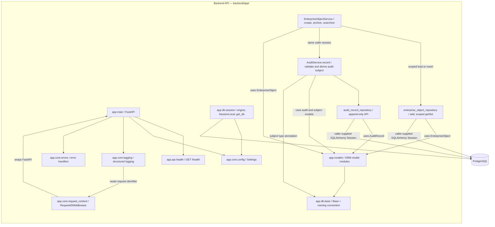
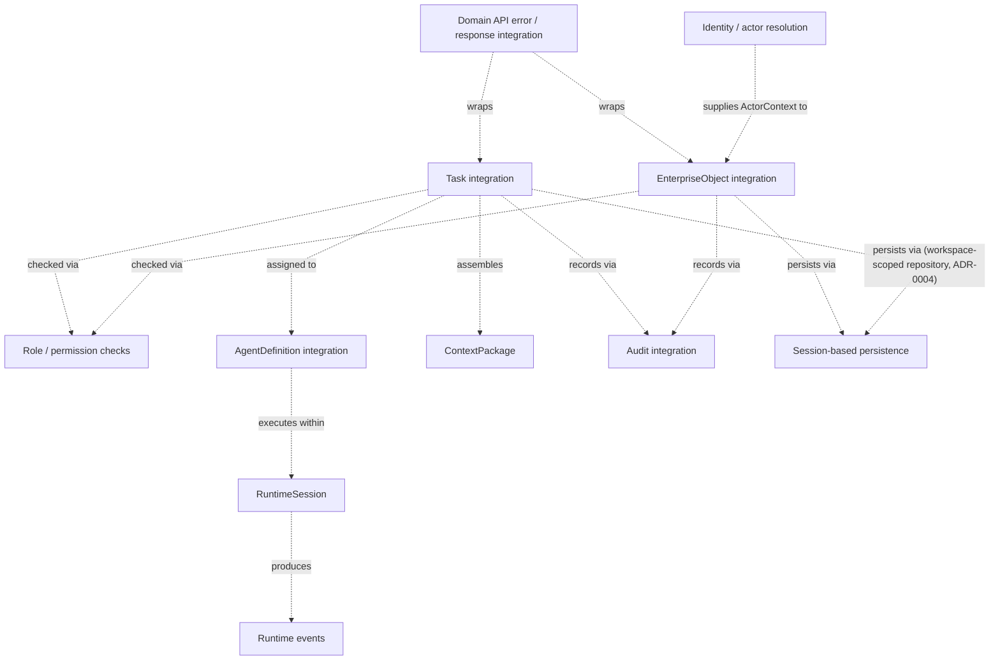

# C3 — Component Diagram (Backend API container)

Scope: components present in this revision of `backend/app/`, including the
WP13/A-12 service slice. Solid nodes and arrows describe implemented pieces,
not completion of an entire work package or availability through an API.
The separate dashed graph retains earlier integration intentions, not current capabilities.
The layer matrix below distinguishes models, repositories, services and APIs.
This Python/FastAPI view follows ADR-0007 and ADR-0003.

For the service/repository slice, dependency edges include its model and
persistence layers (including explicitly labelled type dependencies), matching
the layer matrix; service-internal helpers such as `audit_actions` are outside
this view, not absent from the implementation.

```mermaid
%%{init: {"flowchart": {"nodeSpacing": 100, "rankSpacing": 160, "curve": "linear"}}}%%
flowchart TB
    subgraph API["Backend API — backend/app/"]
        main["app.main / FastAPI"]
        health["app.api.health / GET /health"]
        config["app.core.config / Settings"]
        logging_["app.core.logging / structured logging"]
        errors["app.core.errors / error handlers"]
        request["app.core.request_context / RequestIDMiddleware"]
        session["app.db.session / engine, SessionLocal, get_db"]
        base["app.db.base / Base + naming convention"]
        models["app.models / ORM model modules"]
        eo["EnterpriseObjectService / create, archive, unarchive"]
        eorepo["enterprise_object_repository / add, scoped get/list"]
        audit["AuditService.record / validate and derive audit subject"]
        auditrepo["audit_record_repository / append-only API"]
    end
    db[("PostgreSQL")]
    main --> health
    main --> config
    main --> logging_
    main --> errors
    request -->|"wraps FastAPI"| main
    logging_ -->|"reads request identifier"| request
    session --> config
    session --> db
    models --> base
    eo -->|"scoped load or insert"| eorepo
    eo -->|"same caller session"| audit
    audit --> auditrepo
    eo -->|"uses EnterpriseObject"| models
    audit -->|"uses audit and subject models"| models
    audit -->|"subject type annotation"| base
    eorepo -->|"uses EnterpriseObject"| models
    auditrepo -->|"uses AuditRecord"| models
    eorepo -->|"caller-supplied SQLAlchemy Session"| db
    auditrepo -->|"caller-supplied SQLAlchemy Session"| db
```

Repository-to-database arrows denote persistence through the supplied session,
not repository-owned connections or transaction boundaries. Neither repository
imports the application's session factory. `get_db` is not wired into a domain
route. There is no implemented arrow from EnterpriseObjectService to runtime
events or authorization: those integrations are outside A-12.

## Implemented infrastructure

| Component | Responsibility |
| --- | --- |
| `app.main`, `app.api.health` | FastAPI composition and health route |
| `app.core.config` | Typed settings, required database URL |
| `app.core.logging` | Structured logging with request identifier |
| `app.core.request_context` | Outermost ASGI request-ID middleware, not domain-event correlation |
| `app.core.errors` | ADR-0012 error handlers and error-only envelope |
| `app.db.session` | SQLAlchemy engine, session factory and dependency generator |
| `app.db.base` | Declarative base with constraint naming convention |
| `app.models` | Groups ORM model submodules used by services and repositories; incoming edges refer to those model classes, not to an aggregation API. Its `__init__.py` separately imports models for `backend/alembic/env.py` metadata. |
| `backend/alembic/` | Baseline and subsequent model migrations; not only an empty baseline |

## Domain implementation by layer

“Absent” means not implemented in this revision, not prohibited or authorized
for immediate implementation. No row asserts that an entire WP is complete.

| Subject | Model | Repository | Service | Domain API |
| --- | --- | --- | --- | --- |
| Workspace | Present | Absent | Absent | Absent |
| User / WorkspaceMembership | Both present | Absent | Absent | Absent |
| EnterpriseObject | Present; `phase`, not universal status | Scoped add/get/list | create/archive/unarchive (A-12) | Absent |
| AgentDefinition | Present | Absent | Absent | Absent |
| Task | Present | Absent | Absent | Absent |
| AuditRecord | Present | Append-only insert and scoped reads | Existing AuditService.record (WP19 integration) | Absent |

Role/permission checks, runtime events, ContextPackage and RuntimeSession are
not implemented here. Their domain decisions and work-package dependencies
remain governed by `50_IMPLEMENTATION/MVP_WORK_PACKAGE_PLAN.md` and the relevant
ADRs, rather than by the presence of a dashed node in this diagram.

## Implemented mutation and audit path

EnterpriseObjectService loads transitions by workspace and identity, locks and
refreshes the row, validates its phase, and records the mutation through
AuditService. Create flushes the new active object before the audit call.
AuditService derives the canonical subject and workspace from that persistent
subject and passes a formed audit record to its repository. Business code does
not call the audit repository directly.

The caller supplies one session and owns the transaction and failure rollback.
Neither service nor repository commits or rolls back. Mutation operations return
an identity or None, not an ORM object. Reads remain repository operations.

The A-12 implementation does not discharge ADR-0005's post-commit RuntimeEvent
obligation or amend that ADR. The obligation remains deferred outside this
slice, as recorded in the A-12 approved Deliverables in
`50_IMPLEMENTATION/MVP_WORK_PACKAGE_PLAN.md` (Approval Record: PR 50).
ADR-0009 §3 explicitly permits `active -> superseded` and
`archived -> superseded`; its "A constraint on future work" section requires
the D09-typed relationship. Those transitions remain outside A-12 until that
relationship exists. See `docs/adr/0009-enterprise-object-phase-lifecycle.md`.
No actor attribution, domain API, type/owner mutation or delete operation is
introduced.

The endpoint-level canonical flow remains documented in
`docs/c4/C4_DYNAMIC_CANONICAL_FLOW.md`; this slice implements its bounded
service/repository/audit portion, not a routed endpoint.

## Retained integration intentions — not the implementation view

The earlier diagram's thirteen dashed relationships are retained below rather
than silently removed by the layer taxonomy change. This is a trace of the
earlier target view, not authorization to implement its deferred components.
Some relationships (EnterpriseObject persistence and audit) now have a bounded
implementation shown above. Others still depend on approved future work.
In particular, this graph does not override A-12's RuntimeEvent deferral or
assert that actor resolution, authorization or domain routes exist today.

```mermaid
%%{init: {"flowchart": {"nodeSpacing": 100, "rankSpacing": 160, "curve": "linear"}}}%%
flowchart TB
    identity["Identity / actor resolution"]
    eo["EnterpriseObject integration"]
    rbac["Role / permission checks"]
    task["Task integration"]
    agentDef["AgentDefinition integration"]
    context["ContextPackage"]
    runtime["RuntimeSession"]
    event["Runtime events"]
    audit["Audit integration"]
    dbsession["Session-based persistence"]
    apistd["Domain API error / response integration"]
    identity -.->|"supplies ActorContext to"| eo
    eo -.->|"checked via"| rbac
    task -.->|"checked via"| rbac
    task -.->|"assigned to"| agentDef
    task -.->|"assembles"| context
    agentDef -.->|"executes within"| runtime
    runtime -.->|"produces"| event
    eo -.->|"records via"| audit
    task -.->|"records via"| audit
    task -.->|"persists via (workspace-scoped repository, ADR-0004)"| dbsession
    eo -.->|"persists via"| dbsession
    apistd -.->|"wraps"| eo
    apistd -.->|"wraps"| task
```

## Multi-tenancy: implementation traceability, not a decision record

This section describes the implementation and its governing sources; it does
not create or amend authority. The governing artifacts are
`docs/adr/0004-workspace-scoped-multi-tenancy.md` (Decision),
`docs/adr/0010-workspace-membership-mvp-scope.md`, and Amendments A-03, A-11 and
A-12 in `50_IMPLEMENTATION/MVP_WORK_PACKAGE_PLAN.md`.

ADR-0004 permits no exception to workspace isolation. Its direct-field rule
explicitly excludes `users` and `sessions`; that exception is not permission
to bypass isolation, nor a claim that a sessions implementation exists here.

- The implemented `EnterpriseObject`, `Task`, `AgentDefinition` and
  `AuditRecord` models carry required, indexed `workspace_id` fields.
  Event, ContextPackage and RuntimeSession remain future components; their
  inclusion in the earlier target view does not establish delivered models.
- `User` is not itself workspace-scoped. `WorkspaceMembership` records the
  workspace relationship using `id, workspace_id, user_id, role, created_at`
  under ADR-0010. A-03's rationale and Approval Record (2026-08-03, PR 19)
  distinguish this schema foundation from deferred login, authentication
  middleware and `ActorContext` resolution. No current runtime actor-resolution
  behavior is claimed here.
- A-12 repository reads take workspace identity explicitly. Insert takes an
  already-formed object rather than a second, competing workspace argument.
  Scoping does not implement authorization; the trusted caller supplies context.
- `AuditRecord` carries `workspace_id`, but the value is never supplied
  independently by a calling service — `AuditService.record(...)` derives it
  from the audited subject and constructs the record; `audit_record_repository`
  receives an already-formed record and does not compute the scope. There is
  one owner of this derivation, rather than a separate implementation per
  calling service. No calling service constructs an `AuditRecord.workspace_id`
  itself. This is existing WP19 infrastructure integrated by the A-12 slice,
  not a new WP13 audit service.
