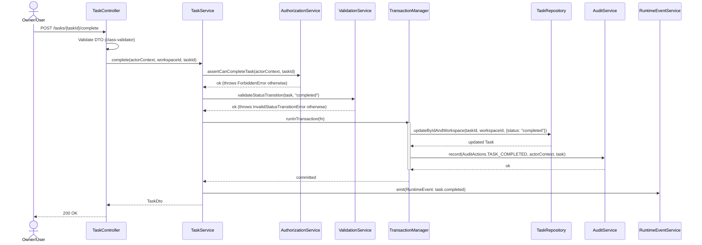

# C4 — Dynamic View: Canonical Mutation Flow

The single most important diagram for anyone writing service code in this
repository. Every state-changing endpoint (Task complete, Decision confirm,
Workspace update, …) follows this shape. Deviating from it is exactly what
ADR-0003 and ADR-0005 exist to prevent, and is checked by the
`bizzi-pre-merge-check` skill.

Worked example: `POST /api/v1/workspaces/{workspaceId}/tasks/{taskId}/complete`.

## Rules this encodes (do not skip a step)

1. **Controller** does DTO validation and delegation only — never calls
   `Az`, `V`, `R`, `Au`, or `E` directly (ADR-0003).
2. **Authorization before validation before mutation.** A forbidden action
   must never reach `ValidationService` or touch the database.
3. **Audit write and domain mutation share one transaction**
   (`TransactionManager.runInTransaction`) — if the update fails, the audit
   record never exists; if it succeeds, the audit record always exists
   (ADR-0005).
4. **Runtime event emission happens after commit**, not before, and is not
   the audit trail — it's a coordination signal only.
5. **Repository methods are workspace-scoped** (`updateByIdAndWorkspace`,
   never a bare `updateById`) — ADR-0004.
6. Errors are one of the shared-kernel error types (`ForbiddenError`,
   `InvalidStatusTransitionError`, etc.) — never an ad-hoc thrown string —
   so the controller layer can map them to consistent HTTP responses per
   `28_API_CONTRACTS/10_ERROR_AND_VALIDATION_CONTRACTS.md`.

## Where this pattern is defined

- `29_BACKEND_SERVICE_DESIGN/03_CONTROLLER_SERVICE_REPOSITORY_PATTERN.md` §3
  (canonical CSR flow) and §22–24 (worked examples: Task completion, Agent
  recommendation apply, Export request).
- `30_BACKEND_IMPLEMENTATION_PLAN/07_SERVICE_IMPLEMENTATION_GUIDE.md`
  (allowed service errors, canonical service method shape).
- `30_BACKEND_IMPLEMENTATION_PLAN/08_REPOSITORY_IMPLEMENTATION_GUIDE.md`
  (required repository method set).
